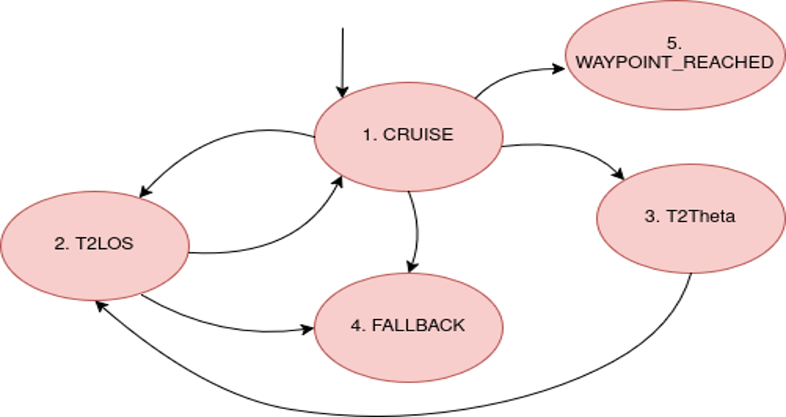

# COLAV (Artemis-QUB)

Our research focuses on developing an autonomous marine navigation system that ensures safe and efficient operations in dynamic environments while adhering to COLREGs in real time. The motion planner prioritizes provable safety, balancing simplicity with competitiveness. Unlike modern deep-learning "black-box" methods, our approach remains interpretable and more advanced than basic state machine methods, enabling effective handling of complex scenarios.

COLAV is designed as a plug-and-play module that can be integrated into any vessel with the proper setup. In collaboration with Artemis, experts in sustainable hydrofoil technology, we leverage the simpler dynamics of hydrofoiling to refine and validate our system through both simulations and real-world tests.

## Hybrid Automaton

The Hybrid Automaton is the core of our COLAV system, responsible for real-time trajectory planning and generating velocity-yaw rate commands at each transition. It operates in five distinct control modes:

- **Cruise Mode**: Maintains a zero-yaw rate when on a direct line of sight to the target waypoint or virtual waypoint. Transitions to Waypoint Mode upon reaching the waypoint acceptance radius, completing motion planning.
- **Fallback Mode**: Engages when an unexpected scenario arises, triggering evasive maneuvers or other necessary functionalities.
- **T2LOS Mode**: Activates when the vessel deviates from the virtual waypoint or goal waypoint. It outputs yaw rate commands to correct course until the vessel achieves a zero error rate with a clear line of sight.
- **T2Theta Mode**: Triggered when the trajectory is predicted to intersect the unsafe set within a threshold distance. It generates a new virtual waypoint, transitions to T2LOS for course correction, and then returns to Cruise Mode, repeating until the final waypoint is reached.
- **Waypoint Mode**: Indicates the successful arrival within the acceptance radius, concluding the hybrid automaton’s operation.

## Architecture

Integrating hybrid automata into real-time systems presents significant challenges. Our ROS-based COLAV server enables the concurrent execution of key modules:

- **[colav_gateway](https://github.com/Artemis-QUB-COLAV/colav-gateway)**: Manages mission requests, updates, and feedback via [colav_protobufs](https://github.com/Artemis-QUB-COLAV/colav-protobuf), enabling seamless conversion between [COLAV ROS interfaces](https://github.com/Artemis-QUB-COLAV/colav-interfaces) and network communication.
- **[colav_risk_assessment](https://github.com/Artemis-QUB-COLAV/colav-risk-assessment)**: Computes real-time unsafe sets, predicts trajectories, and assesses collision risk for adaptive collision avoidance.
- **[colav_mapping](https://github.com/Artemis-QUB-COLAV/colav-mapping)**: Processes OSM and sensor data to create static and dynamic map layers. It combines rasterized vector maps with unsafe set overlays, applying bloating for cost map generation.
- **[colav_hybrid_automaton](https://github.com/Artemis-QUB-COLAV/colav-hybrid-automaton)**: Implements state-switching logic with Simulink Stateflow and ROS, generating yaw-rate and velocity commands while managing system transitions in real time.

This architecture ensures safe, adaptive navigation with real-time vessel sensor integration.

## Testing

The COLAV system is designed for easy integration via Protobuf I/O, enabling seamless testing. We have developed a geometric simulator to run real-world marine scenarios, including dynamic obstacles with state, trajectory, and geometry data, as well as static obstacles like landmasses and harbors. Using **commonocean-io**, we stream real-time mock sensor fusion data and retrieve velocity and yaw rate commands from the hybrid automaton. The drivability checker ensures feasible trajectories, while **commonocean-rules** enforces COLREG compliance. This allows systematic validation of the system’s decision-making and trajectory generation.

Looking ahead, we plan to test the system in 3D game engine simulations with hydrofoils for Artemis and ultimately deploy it on a real vessel. The current implementation of the testing simulation is contained in the [colav_commonocean_testing](https://github.com/Artemis-QUB-COLAV/colav-commonocean-testing) repository.

